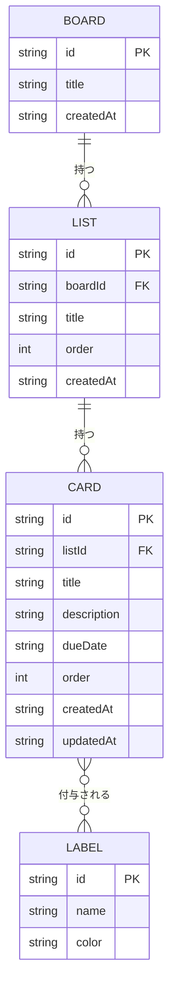

# データベース設計

[要件定義書](requirements.md)の詳細ドキュメント。

## ER図(データの関連)

- 1つのボードは複数のリストを持つ。
- 1つのリストは複数のカードを持つ。
- 1枚のカードには複数のラベルを付けられ、1つのラベルは複数のカードに付けられる(多対多)。データベース上はカードとラベルを結びつける中間テーブルで管理する。

## データ項目

### Board(ボード)
| 項目 | 型 | 説明 |
| --- | --- | --- |
| id | string | 一意なID |
| title | string | ボード名 |
| createdAt | string | 作成日時 |

### List(リスト)
| 項目 | 型 | 説明 |
| --- | --- | --- |
| id | string | 一意なID |
| boardId | string | 所属するボードのID |
| title | string | リスト名 |
| order | number | ボード内での並び順 |
| createdAt | string | 作成日時 |

### Card(カード)
| 項目 | 型 | 説明 |
| --- | --- | --- |
| id | string | 一意なID |
| listId | string | 所属するリストのID |
| title | string | カードタイトル |
| description | string | 説明文 |
| dueDate | string \| null | 期限日 |
| order | number | リスト内での並び順 |
| createdAt / updatedAt | string | 作成日時・更新日時 |

### Label(ラベル)
| 項目 | 型 | 説明 |
| --- | --- | --- |
| id | string | 一意なID |
| name | string | ラベル名 |
| color | string | 表示色 |

### CardLabel(カードとラベルの中間テーブル)
| 項目 | 型 | 説明 |
| --- | --- | --- |
| cardId | string | カードのID |
| labelId | string | ラベルのID |
