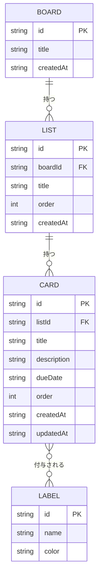

# Trello風タスク管理アプリ 要件定義書

## 1. 背景・目的

個人でタスクを見える化・管理できる、Trello風のシンプルなタスク管理アプリを作成する。
既存のTrelloのような高機能・多人数向けサービスではなく、必要最低限の機能に絞った個人利用/デモ用途のアプリとする。

## 2. 対象ユーザー

- アプリ利用者本人(個人利用)。ログインや複数ユーザーでの共同編集は想定しない。

## 3. ユースケース

### 3.1 アクター
- **利用者本人**: アプリを使ってタスクを作成・管理する唯一の登場人物。

### 3.2 ユースケース一覧
| ID | ユースケース名 | 概要 |
| --- | --- | --- |
| UC-01 | ボードを作成する | 新しいボードを作り、タスク管理を開始する。 |
| UC-02 | リストを作成する | ボード内に工程(To Do / Doing / Doneなど)を表すリストを追加する。 |
| UC-03 | カードを作成する | リスト内にタスクを表すカードを追加する。 |
| UC-04 | カードを移動する | ドラッグ&ドロップでカードを別のリストへ移し、進捗を更新する。 |
| UC-05 | カードの詳細を編集する | 説明・期限日・ラベルを設定し、タスク内容を明確にする。 |
| UC-06 | 期限切れのタスクを確認する | ボード上で期限切れのカードを一目で把握する。 |
| UC-07 | ボード/リスト/カードを削除する | 不要になった項目を削除して整理する。 |

### 3.3 代表的なユースケースの詳細

#### UC-03 カードを作成する
- **事前条件**: ボードとリストが1つ以上存在する。
- **基本フロー**:
  1. 利用者がリスト下部の「+ カード追加」をクリックする。
  2. カードタイトルを入力する。
  3. 保存すると、リストの末尾にカードが追加され、データベースに保存される。
- **事後条件**: 新しいカードがリストに表示される。

#### UC-04 カードを移動する
- **事前条件**: 移動対象のカードと、移動先のリストが存在する。
- **基本フロー**:
  1. 利用者がカードをドラッグする。
  2. 移動先のリスト(または同一リスト内の別の位置)にドロップする。
  3. カードの所属リスト・並び順が更新され、データベースに反映される。
- **事後条件**: カードが新しい位置に表示される。

#### UC-05 カードの詳細を編集する
- **事前条件**: 編集対象のカードが存在する。
- **基本フロー**:
  1. 利用者がカードをクリックし、詳細モーダルを開く。
  2. 説明文・期限日・ラベルを編集する。
  3. 「保存」をクリックすると内容が反映され、データベースに保存される。
- **事後条件**: カード一覧表示にも更新後のラベル・期限日が反映される。

## 4. システム構成方針

- **フロントエンド + バックエンドAPI + データベース**の構成とする。
- フロントエンド: **Vite + React + TypeScript**、ドラッグ&ドロップは **@dnd-kit** を使用。
- バックエンド: 自前のAPIサーバーを用意し、フロントエンドからのリクエストを受けてデータベースを読み書きする。
- データベース: **SQLite** などの軽量DBを採用し、ファイルベースで運用する(大規模なDBサーバーの構築は不要)。
- データはすべてデータベースに保存され、永続化する(ブラウザのlocalStorageは使用しない)。
- 認証機能、複数ユーザー対応、デプロイ用CI/CDパイプラインは本バージョンでは扱わない(利用者は引き続き1人を想定)。

### 4.1 データの流れ

```
┌───────────────┐   リクエスト(作成/更新/削除/取得)   ┌───────────────┐   読み書き   ┌───────────────┐
│  ブラウザ       │ ───────────────────────────────▶ │  バックエンドAPI │ ──────────▶ │  データベース    │
│ (React画面)     │ ◀─────────────────────────────── │               │ ◀────────── │ (SQLite)       │
└───────────────┘        レスポンス(データ)           └───────────────┘   結果      └───────────────┘
```
- 画面上での操作(ボード/リスト/カードの作成・編集・削除・並び替え)は、その都度APIを通じてデータベースに反映される。
- 画面を開いたとき・再読み込みしたときは、APIを経由してデータベースから最新の内容を取得して表示する。

## 5. 機能要件

### 5.1 ボード管理
- ボードを作成できる。
- ボードのタイトルを編集できる。
- ボードを削除できる(配下のリスト・カードも合わせて削除)。

### 5.2 リスト管理(例: To Do / Doing / Done)
- ボード内にリスト(カラム)を作成できる。
- リストのタイトルを編集できる。
- リストを削除できる(配下のカードも合わせて削除)。
- リストの並び順をドラッグ&ドロップで変更できる。

### 5.3 カード管理
- リスト内にカードを作成できる。
- カードのタイトルを編集できる。
- カードを削除できる。
- カードをドラッグ&ドロップで同一リスト内の並び替え、および別リストへの移動ができる。

### 5.4 カード詳細
- カードをクリックすると詳細編集画面(モーダル)が開く。
- カードの説明文(複数行のテキスト)を編集できる。
- カードの期限日を設定・編集できる。
- カードにラベル(色付きタグ)を付与・削除できる。
- カード一覧表示(サマリー)にラベル色と期限日が分かるように表示する。
- 期限切れのカードは視覚的に区別できるようにする(強調表示)。

### 5.5 データ永続化
- 上記の操作内容はAPIを通じてデータベースに自動保存され、リロード後・別セッションでも保持される。
- データベースが空の場合は、初期シードデータ(サンプルのボード・リスト)を投入する。

## 6. 非機能要件

- 特別な高負荷・大量データを想定しない(個人利用規模: ボード数個、リスト数個、カード数十〜数百件程度)。
- レスポンシブ対応は簡易的でよい(リストが多い場合は横スクロールで対応)。
- 自動テスト・CI環境の構築は本バージョンでは必須としない。手動でのブラウザ動作確認で品質を担保する。
- 対応ブラウザはモダンブラウザ(Chrome, Edge等の最新版)を想定する。

## 7. 画面一覧

| 画面 | 概要 |
| --- | --- |
| ボード画面 | リストを横並びで表示し、各リスト内にカードを表示する。カードの追加・並び替え・リスト間移動を行うメイン画面。 |
| カード詳細モーダル | カードクリックで開く。説明・期限・ラベルを編集する。 |

## 8. 画面イメージ

### 8.1 ボード画面

```
┌─────────────────────────────────────────────────────────────┐
│  ボード名                                                     │
├────────────────┬────────────────┬────────────────┬───────────┤
│ To Do      [+] │ Doing      [+] │ Done       [+] │ [+ リスト追加]│
├────────────────┼────────────────┼────────────────┤           │
│ ┌────────────┐ │ ┌────────────┐ │ ┌────────────┐ │           │
│ │ 資料作成    │ │ │ 資料レビュー │ │ │ 環境構築    │ │           │
│ │ 🔴 8/25期限 │ │ │ 🟡         │ │ │ 🟢         │ │           │
│ └────────────┘ │ └────────────┘ │ └────────────┘ │           │
│ ┌────────────┐ │                │                │           │
│ │ MTG準備     │ │                │                │           │
│ └────────────┘ │                │                │           │
│ [+ カード追加]  │ [+ カード追加]  │ [+ カード追加]  │           │
└────────────────┴────────────────┴────────────────┴───────────┘
```
- リストを横並びで表示し、カードはドラッグ&ドロップで並び替え・リスト間移動ができる。
- カード上部に期限日とラベル色を表示し、期限切れのカードは色などで強調表示する。

### 8.2 カード詳細モーダル

```
┌───────────────────────────────────────────┐
│  カードタイトル                     [× 閉じる] │
├───────────────────────────────────────────┤
│  ラベル: 🔴重要  🟢完了                      │
│  期限日: 2026/08/25                         │
│                                             │
│  説明:                                      │
│  ┌───────────────────────────────────────┐  │
│  │ ここに詳細やメモを記入                    │  │
│  │                                       │  │
│  └───────────────────────────────────────┘  │
│                                             │
│                          [削除]   [保存]     │
└───────────────────────────────────────────┘
```
- カードをクリックすると開き、説明・期限日・ラベルをこの画面でまとめて編集する。

## 9. ER図(データの関連)


- 1つのボードは複数のリストを持つ。
- 1つのリストは複数のカードを持つ。
- 1枚のカードには複数のラベルを付けられ、1つのラベルは複数のカードに付けられる(多対多)。データベース上はカードとラベルを結びつける中間テーブルで管理する。

## 10. データ項目

### Board(ボード)
| 項目 | 型 | 説明 |
| --- | --- | --- |
| id | string | 一意なID |
| title | string | ボード名 |
| createdAt | string | 作成日時 |

### List(リスト)
| 項目 | 型 | 説明 |
| --- | --- | --- |
| id | string | 一意なID |
| boardId | string | 所属するボードのID |
| title | string | リスト名 |
| order | number | ボード内での並び順 |
| createdAt | string | 作成日時 |

### Card(カード)
| 項目 | 型 | 説明 |
| --- | --- | --- |
| id | string | 一意なID |
| listId | string | 所属するリストのID |
| title | string | カードタイトル |
| description | string | 説明文 |
| dueDate | string \| null | 期限日 |
| order | number | リスト内での並び順 |
| createdAt / updatedAt | string | 作成日時・更新日時 |

### Label(ラベル)
| 項目 | 型 | 説明 |
| --- | --- | --- |
| id | string | 一意なID |
| name | string | ラベル名 |
| color | string | 表示色 |

### CardLabel(カードとラベルの中間テーブル)
| 項目 | 型 | 説明 |
| --- | --- | --- |
| cardId | string | カードのID |
| labelId | string | ラベルのID |

## 11. 制約・リスク(ご利用にあたっての注意点)

- **データベースサーバー(APIサーバー)が起動していないと利用できません。** ブラウザだけでは動作せず、裏側のAPI・データベースが立ち上がっている必要があります。
- **データベースファイルの管理者が必要です。** SQLiteのデータファイルが壊れる・誤って削除されると、保存していたデータが失われます。定期的なバックアップ(ファイルのコピー)を推奨します。
- **同時アクセス時の挙動は簡易的です。** 複数の画面・タブから同時に操作した場合の競合制御(排他制御)までは作り込まない想定です。
- **引き続き個人利用を想定しています。** ログイン機能はないため、APIにアクセスできる人は誰でもデータを閲覧・編集できます。社内サーバー等、閉じたネットワークでの利用を前提とします。
- **サーバーの公開範囲に注意が必要です。** インターネット上に公開する場合は、想定外の第三者がアクセスできないよう、ネットワーク設定(アクセス制限)を別途検討する必要があります。

## 12. 対象外(スコープ外)

- ユーザー登録・ログイン・認証機能
- 複数ユーザーでの共同編集・リアルタイム同期
- 通知機能、検索・フィルタ機能
- 添付ファイル、コメント機能
- 自動テスト・CI/CDパイプライン
- 大規模アクセスを想定したサーバー冗長化・スケーリング

## 13. 今後の進め方

1. 本要件定義書のレビュー・確定
2. 実装計画の作成(技術詳細設計)
3. 実装(スキャフォールド → データ層 → CRUD UI → ドラッグ&ドロップ → カード詳細 → 仕上げ)
4. ブラウザでの手動動作確認
